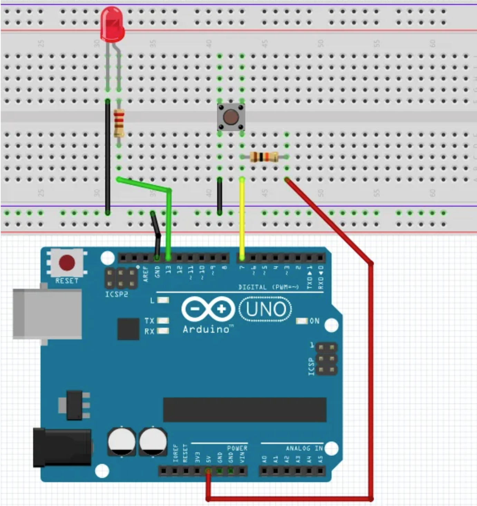

# MitoSoft.HomeNet.Arduino

Lightweight Arduino library to use Arduino and optocoupler devices in an IoT environment for smart-homes.

## Includes Functionality

- debounced GPIO input (usage as pullup as well as pulldown)
- inverted GPIO output (to use with standard optocouplers)
- blind and jalousie controller (reference run, actual position, run to a specific position, synchronous run, blind positioning, ...)
- MQTT helpers (included standard interfaces for different popular Arduino MQTT brokers)
- Ethernet helper (standard interface with reconnection pattern for Arduino Ethernet Shields)

In smart homes it's easy to implement:

- blind controller
- light controller
- alarm controller
- control the main door
- control the garage doors

## Hardware Setup

### GPIO Pin Usage



The image above shows a typical wiring example for a button with an LED indicator.

### Important: Reserved Pins on Arduino Mega

When using an **Arduino Mega** with an Ethernet Shield, the following pins are **reserved** and **must not be used** as GPIO:

- **Pin 0 (RX)** and **Pin 1 (TX)**: Serial communication pins (used for Serial Monitor / debugging)
- **Pin 4**: Used by the SD card on most Ethernet Shields
- **Pin 10**: SPI Chip Select for Ethernet
- **Pin 50 (MISO)**, **Pin 51 (MOSI)**, **Pin 52 (SCK)**, **Pin 53 (SS)**: SPI bus pins for Ethernet Shield

> **Tip:** Always leave these pins free to avoid communication issues with the Ethernet Shield or serial debugging.

## Dependencies

The library has dependencies to the following packages:

- `SPI.h`
- `Ethernet.h`
- `ArduinoMqttClient.h`

## License

THE SOFTWARE IS PROVIDED "AS IS", WITHOUT WARRANTY OF ANY KIND,
EXPRESS OR IMPLIED, INCLUDING BUT NOT LIMITED TO THE WARRANTIES OF
MERCHANTABILITY, FITNESS FOR A PARTICULAR PURPOSE AND
NONINFRINGEMENT. IN NO EVENT SHALL THE AUTHORS OR COPYRIGHT HOLDERS BE
LIABLE FOR ANY CLAIM, DAMAGES OR OTHER LIABILITY, WHETHER IN AN ACTION
OF CONTRACT, TORT OR OTHERWISE, ARISING FROM, OUT OF OR IN CONNECTION
WITH THE SOFTWARE OR THE USE OR OTHER DEALINGS IN THE SOFTWARE.

## Examples

### Example 1: Simple GPIO Usage (Button-controlled Shutter)

A simple example showing how to control a shutter with two buttons (up/down):

```c++
/*
 Name: SimpleGPIOUsing.ino
 Short GPIO-only example: one shutter controlled by two buttons
*/

#include <MitoSoft.h>

// inputs (buttons)
DebouncingInput btnDown(24, INPUT_PULLUP, 50);
DebouncingInput btnUp(25, INPUT_PULLUP, 50);

// single shutter (short example)
ShutterController shutter(20000, 2000);
DigitalOutput outUp(44, STANDARD);
DigitalOutput outDown(45, STANDARD);

void setup() {
  Serial.begin(9600);
  Serial.println("start SimpleGPIOUsing.ino (short)");

  // make a reference run and set a test position
  shutter.referenceRun();
  shutter.setShutterAndFinPosition(50.0, 0.0);
}

void loop() {
  // button triggered commands
  if (btnDown.risingEdge()) {
	shutter.runDown();
  } else if (btnUp.risingEdge()) {
	shutter.runUp();
  }

  // update outputs according to shutter state
  if (shutter.started()) {
	Serial.println("Started: " + shutter.getDirectionAsText());
	if (shutter.getDirection() == 1) { // DOWN
	  outUp.setOff(); outDown.setOn();
	} else { // UP
	  outUp.setOn(); outDown.setOff();
	}
  } else if (shutter.stopped()) {
	Serial.println("Stopped Pos: " + String(shutter.getPosition()));
	// deactivate outputs when stopped
	outUp.setOff(); outDown.setOff();
  }

  shutter.loop();
  delay(10);
}
```

### Example 2: MQTT-only Usage

A simple MQTT example showing how to control a cover and a light via MQTT:

```c++
/*
  Name: SimpleMqttUsing.ino
  Short MQTT-only example: one cover and one light
*/

#include <SPI.h>
#include <Ethernet.h>
#include <MitoSoft.h>

// network configuration
byte mac[] = { 0xDE, 0xAD, 0xBE, 0xEF, 0xFE, 0xED };
IPAddress ip(192, 168, 2, 200);
IPAddress broker(192, 168, 2, 125);

EthernetClient ethClient;
EthernetHelper ethHelper(mac, ip, false);
MqttClient mqttClient(ethClient);
MqttHelper mqttHelper(mqttClient, 15000, false);

// single cover and light
ShutterController cover(20000, 0);
DigitalOutput coverUp(5, STANDARD);
DigitalOutput coverDown(6, STANDARD);
LightController lightOut(8, INVERTED);

void setup() {
  ethHelper.dhcpSetup();
  mqttHelper.init(broker, "SimpleMqttUsing", "user", "passwd");
  cover.referenceRun();
}

void loop() {
  String topic = "";
  String message = "";

  if (mqttHelper.onMessageReceived()) {
	topic = mqttHelper.getLastTopic();
	message = mqttHelper.getLastMessage();
  }

  // cover via MQTT
  if (topic == "SimpleMqttUsing/cover/command/mode") {
	if (message == "down") cover.runDown();
	else if (message == "up") cover.runUp();
	else if (message == "stop") cover.runStop();
  }
  else if (topic == "SimpleMqttUsing/cover/command/pos") {
	cover.setShutterPosition(message.toDouble());
  }

  // light via MQTT
  if (topic == "SimpleMqttUsing/light/command/mode") {
	if (message == "toggle") {
	  mqttHelper.publish("SimpleMqttUsing/light/state/mode", String(lightOut.toggle()), true);
	}
	else if (message == "on") {
	  lightOut.setOn();
	  mqttHelper.publish("SimpleMqttUsing/light/state/mode", "1", true);
	}
	else if (message == "off") {
	  lightOut.setOff();
	  mqttHelper.publish("SimpleMqttUsing/light/state/mode", "0", true);
	}
  }

  // publish cover state when stopped
  if (cover.stopped()) {
	mqttHelper.publish("SimpleMqttUsing/cover/state/pos", String(cover.getPosition()), true);
	mqttHelper.publish("SimpleMqttUsing/cover/state/mode", "stopped", false);
  }

  cover.loop();
  lightOut.loop();

  if (mqttHelper.onConnected()) mqttHelper.subscribe("SimpleMqttUsing/+/command/#");
  ethHelper.loop();
  mqttHelper.loop();
  delay(50);
}
```

**Test with mosquitto_pub:**
```bash
# Move cover down
mosquitto_pub -h 192.168.2.125 -t SimpleMqttUsing/cover/command/mode -m "down"

# Move cover to position 50%
mosquitto_pub -h 192.168.2.125 -t SimpleMqttUsing/cover/command/pos -m "50"

# Toggle light
mosquitto_pub -h 192.168.2.125 -t SimpleMqttUsing/light/command/mode -m "toggle"
```

### Example 3: MQTT + GPIO Combined

This example shows how to control a cover and a light using both MQTT and physical buttons:

```c++
/*
  Name: MqttAndGpio.ino
  Short example: one cover (shutter) and one light with MQTT+GPIO
*/

#include <SPI.h>
#include <Ethernet.h>
#include <MitoSoft.h>

// network configuration (adjust to your network)
byte mac[] = { 0xDE, 0xAD, 0xBE, 0xEF, 0xFE, 0xED };
IPAddress ip(192, 168, 2, 200);
IPAddress broker(192, 168, 2, 125);

EthernetClient ethClient;
EthernetHelper ethHelper(mac, ip, false);
MqttClient mqttClient(ethClient);
MqttHelper mqttHelper(mqttClient, 15000, false);

// one cover
DebouncingInput coverBtnDown(2);
DebouncingInput coverBtnUp(3);
ShutterController cover(20000, 0);
DigitalOutput coverUp(5, STANDARD);
DigitalOutput coverDown(6, STANDARD);

// one light
DebouncingInput lightBtn(7);
LightController lightOut(8, INVERTED);

void setup() {
  ethHelper.fixIpSetup();
  mqttHelper.init(broker, "MqttAndGpio", "user", "passwd");
  cover.referenceRun();
}

void loop() {
  String topic = "";
  String message = "";
  if (mqttHelper.onMessageReceived()) {
	topic = mqttHelper.getLastTopic();
	message = mqttHelper.getLastMessage();
  }

  // cover control (buttons or MQTT)
  if (coverBtnDown.risingEdge() || (topic == "MqttAndGpio/cover/command/mode" && message == "down")) {
	cover.runDown();
  } else if (coverBtnUp.risingEdge() || (topic == "MqttAndGpio/cover/command/mode" && message == "up")) {
	cover.runUp();
  } else if (topic == "MqttAndGpio/cover/command/pos") {
	cover.setShutterPosition(message.toDouble());
  }

  // light control (button or MQTT)
  if (lightBtn.risingEdge() || (topic == "MqttAndGpio/light/command/mode" && message == "toggle")) {
	mqttHelper.publish("MqttAndGpio/light/state/mode", String(lightOut.toggle()), true);
  }

  // publish cover state
  if (cover.started()) {
	if (1 == cover.getDirection()) { // DOWN
	  coverUp.setOff(); coverDown.setOn();
	  mqttHelper.publish("MqttAndGpio/cover/state/mode", "closing", false);
	} else if (2 == cover.getDirection()) { // UP
	  coverUp.setOn(); coverDown.setOff();
	  mqttHelper.publish("MqttAndGpio/cover/state/mode", "opening", false);
	}
  }
  if (cover.stopped()) {
	coverUp.setOff(); coverDown.setOff();
	mqttHelper.publish("MqttAndGpio/cover/state/mode", "stopped", false);
	mqttHelper.publish("MqttAndGpio/cover/state/pos", String(cover.getPosition()), true);
  }

  cover.loop();
  lightOut.loop();

  if (mqttHelper.onConnected()) mqttHelper.subscribe("MqttAndGpio/+/command/#");
  ethHelper.loop();
  mqttHelper.loop();
  delay(10);
}
```

> **More examples** can be found in the `example/` folder of this repository.
